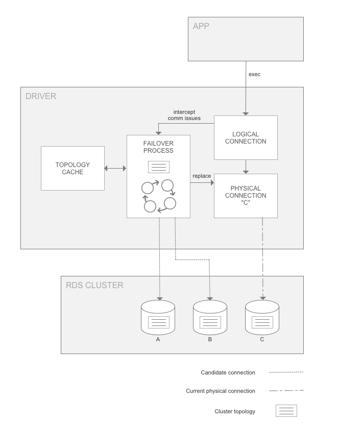

# Amazon Web Services (AWS) JDBC Driver for MySQL

The AWS JDBC Driver for MySQL is a client driver designed to take full advantage of the high database availability offered by Aurora MySQL. In the event of a database failure, this availability is provided  via a process known as failover, which is described below. 

The AWS JDBC Driver was created to be a drop-in replacement for the open-source [MySQL-Connector-J JDBC driver](https://github.com/mysql/mysql-connector-j) and is based off of it. This means that the AWS JDBC Driver can be used in place to interact with Aurora MySQL, RDS MySQL, and on-premise MySQL, without experiencing any unexpected or undesired behavior.

## What is Failover?

In an Amazon Aurora DB cluster, failover is a mechanism by which Aurora automatically repairs the cluster status when a primary DB instance becomes unavailable. It achieves this goal by electing an Aurora Replica to become the new primary DB instance, so that the cluster can provide maximum availability to a primary read-write DB instance. The AWS JDBC Driver for MySQL is designed to coordinate with this behavior in order to provide minimal downtime in the event of a DB instance failure.

## Benefits of the AWS JDBC Driver for MySQL

Although Aurora is able to provide maximum availability through the use of failover, existing client drivers do not currently take full advantage of this functionality. This is partially due to the time required for the DNS of the new primary instance to be fully resolved in order to properly direct the connection. The AWS JDBC Driver for MySQL fully utilizes failover behavior by maintaining a cache of the Aurora cluster topology and each instance's role (Replica or primary DB instance). This topology is provided via a direct query to the Aurora database, essentially providing a shortcut to bypass the delays caused by DNS resolution. With this knowledge, the AWS JDBC Driver can more closely monitor the Aurora cluster status so that a connection to the new primary DB instance can be established as fast as possible. Additionally, as noted above, the AWS JDBC Driver has been designed to be a drop-in replacement for other MySQL JDBC drivers and can be used to interact with regular RDS and MySQL databases as well as Aurora MySQL.

## The AWS JDBC Driver Failover Process

<div style="text-align:center"></div>

The figure above provides a simplified overview of how the AWS JDBC Driver handles an Aurora failover encounter. Starting at the top of the diagram, an application with the AWS JDBC Driver on its class path uses the driver to get a logical connection to an Aurora database. In this example, the application requests a connection using the Aurora cluster URL endpoint and is returned a logical connection that is physically connected to the primary DB instance in the cluster, instance C. Due to how the application operates against the logical connection, the physical connection details about which specific DB instance it is connected to have been abstracted away. Over the course of the application's lifetime, it executes various statements against the logical connection. If DB instance C is stable and active, these statements succeed and the application continues as normal. If DB instance C later experiences a failure, Aurora will initiate failover to promote a new primary instance. At the same time, the AWS JDBC Driver will intercept the related communication exception and kick off its own internal failover process. In this case, in which the primary instance has failed, the driver will use its internal topology cache to temporarily connect to an active Aurora Replica instance. This Replica instance will be periodically queried for the cluster topology until the new primary instance is identified (instance A or B in this case). At this point, the driver will connect to the new primary instance and return control to the application by raising a SQLException with SQLState 08S02 so that they can re-configure their session state as required. Although the DNS endpoint for the cluster may not yet resolve to the new primary instance, the driver has already discovered this new instance during its failover process and will be directly connected to it when the application continues executing statements. In this way the driver provides a faster way to reconnect to a newly promoted DB instance, thus increasing the availability of the DB cluster.

## Requirements

The AWS JDBC Driver requires Amazon Corretto 8+ or Java 8+.

To install Amazon Corretto, please refer to the [Amazon Corretto user guides](https://docs.aws.amazon.com/corretto/index.html).

## Getting Started

For an example of how to use the AWS JDBC Driver, including coding samples, please refer to "Getting started with AWS JDBC driver for MySQL" [TODO: insert link here]

### Connection URL Descriptions

There are many different types of URLs that can be provided to connect to an Aurora DB cluster. For some of these URL types, the AWS JDBC Driver will require the user to provide some information about the Aurora cluster in order to provide failover functionality. This section outlines the various URL types. For each type, information is provided on how the driver will behave and what information the driver requires about the cluster, if applicable.

| URL Type        | Example           | Required Parameters  | Driver Behavior |
| ------------- |-------------| :-----:| --- |
| Cluster Endpoint      | `jdbc:mysql://db-identifier.cluster-czygpppufgy4.us-east-2.rds.amazonaws.com:3306` | None | *Initial connection:* primary DB instance<br/>*Failover behavior:* connect to the new primary DB instance |
| Read-Only Cluster Endpoint      | `jdbc:mysql://db-identifier.cluster-ro-czygpppufgy4.us-east-2.rds.amazonaws.com:3306`      |   None |  *Initial connection:* any Replica instance<br/>*Failover behavior:* prioritize connecting to any active Replica. May connect to the primary DB instance if it provides a faster connection|
| Instance Endpoint | `jdbc:mysql://instance-1.czygpppufgy4.us-east-2.rds.amazonaws.com:3306`      |    None | *Initial connection:* the instance specified (instance 1)<br/>*Failover behavior:* connect to the primary DB instance|
| RDS Custom Cluster | `jdbc:mysql://db-identifier.cluster-custom-czygpppufgy4.us-east-2l.rds.amazonaws.com:3306`      |    None | *Initial connection:* any instance in the custom cluster<br/>*Failover behavior:* connect to the primary DB instance (note that this may be outside of the custom cluster) |
| IP Address | `jdbc:mysql://10.10.10.10:3306`      |    `clusterInstanceHostPattern` | *Initial connection:* the instance specified<br/>*Failover behavior:* connect to the primary DB instance |
| Custom Domain | `jdbc:mysql://my-custom-domain.com:3306`      |    `clusterInstanceHostPattern` | *Initial connection:* the instance specified<br/>*Failover behavior:* connect to the primary DB instance |
| Non-Aurora Endpoint | `jdbc:mysql://localhost:3306`     |    `clusterInstanceHostPattern` | A regular JDBC connection will be returned - no failover functionality |

For more information about parameters that can be configured with the AWS JDBC Driver, please refer to "Getting started with AWS JDBC driver for MySQL" [insert link here]

## Development

### Setup

After you have installed Amazon Corretto or Java according to the requirements section, use the below command to clone the driver repository.

```
$ git clone https://github.com/awslabs/amazon-qldb-driver-go.git //TODO: replace with final AWS JDBC Driver GitHub link
$ cd mysql-connector-j
```
Changes can now be made in the repository.
### Building the AWS JDBC Driver for MySQL

To build the AWS JDBC Driver without running the tests, navigate into the mysql-connector-j directory and run the following command:
```
gradlew build -x test
```

To build the driver and run the tests, you will need to have Docker installed. Please refer to the section below and then run the following command:

```
gradlew build
```

### Running the Tests

To run the tests for the AWS JDBC Driver, you will need to install [Docker](https://docs.docker.com/get-docker/). After installing, execute the following commands to spin up the Docker servers that the tests will run against:
```
$ cd mysql-connector-j/docker
$ docker-compose up -d
$ cd ../
```
You can now run the tests in the mysql-connector-j directory using the following command:
[TODO: add information about how to set up the open SSL certificates]
```
gradlew test
```
To shut down the Docker servers after finishing testing:
```
$ cd mysql-connector-j/docker
$ docker-compose down && docker-compose rm
$ cd ../
```

## Getting Help

[TODO: add content here]

## Opening Issues

[TODO: add content here]

## Documentation

For additional documentation on the AWS JDBC Driver, [please refer to the documentation for the open-source mysql-connector-j driver that the AWS JDBC Driver was based on](https://dev.mysql.com/doc/connector-j/8.0/en/).

## License

[TODO: add license information here]