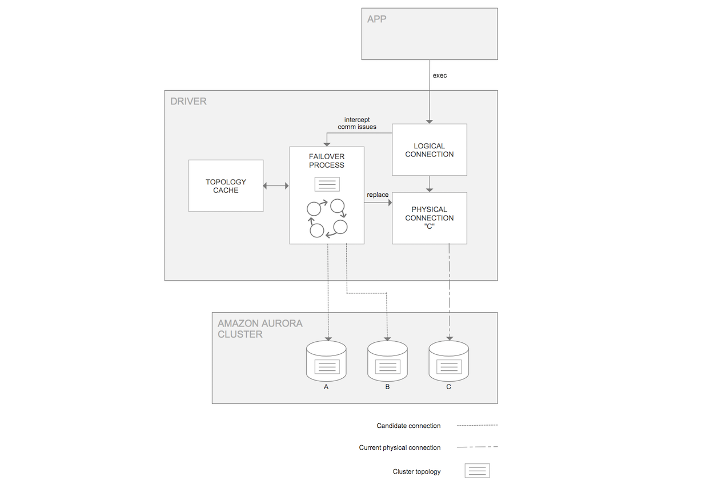

# Amazon Web Services (AWS) JDBC Driver for MySQL

**The Amazon Web Services (AWS) JDBC Driver for MySQL** is a driver that enables applications to take full advantage of the features of clustered MySQL databases. It is based on and can be used as a drop-in compatible for the [MySQL Connector/J driver](https://github.com/mysql/mysql-connector-j) and is compatible with all MySQL deployments.

The AWS JDBC Driver for MySQL currently enables fast failover for Amazon Aurora with MySQL compatibility. Support for additional features of clustered databases, including features of Amazon RDS for MySQL and on-premises MySQL deployments, is planned.

> **IMPORTANT** Because this project is in preview, you may see breaking changes throughout. We encourage you to experiment with MySQL driver but DO NOT adopt it for production use. Use of MySQL driver in preview is subject to the terms and conditions contained in the [AWS Service Terms](https://aws.amazon.com/service-terms), particularly the Beta Service Participation Service Terms, and apply to any drivers not marked as 'Generally Available'.

## What is Failover?

In an Amazon Aurora DB cluster, failover is a mechanism by which Aurora automatically repairs the DB cluster status when a primary DB instance becomes unavailable. It achieves this goal by electing an Aurora Replica to become the new primary DB instance, so that the DB cluster can provide maximum availability to a primary read-write DB instance. The AWS JDBC Driver for MySQL is designed to coordinate with this behavior in order to provide minimal downtime in the event of a DB instance failure.

## Benefits of the AWS JDBC Driver for MySQL

Although Aurora is able to provide maximum availability through the use of failover, existing client drivers do not currently take full advantage of this functionality. This is partially due to the time required for the DNS of the new primary DB instance to be fully resolved in order to properly direct the connection. The AWS JDBC Driver for MySQL fully utilizes failover behavior by maintaining a cache of the Aurora cluster topology and each DB instance's role (Aurora Replica or primary DB instance). This topology is provided via a direct query to the Aurora database, essentially providing a shortcut to bypass the delays caused by DNS resolution. With this knowledge, the AWS JDBC Driver can more closely monitor the Aurora DB cluster status so that a connection to the new primary DB instance can be established as fast as possible. Additionally, as noted above, the AWS JDBC Driver is designed to be a drop-in compatible for other MySQL JDBC drivers and can be used to interact with regular RDS and MySQL databases as well as Aurora MySQL.

## The AWS JDBC Driver Failover Process

<div style="text-align:center"></div>

The figure above provides a simplified overview of how the AWS JDBC Driver handles an Aurora failover encounter. Starting at the top of the diagram, an application with the AWS JDBC Driver on its class path uses the driver to get a logical connection to an Aurora database. In this example, the application requests a connection using the Aurora DB cluster endpoint and is returned a logical connection that is physically connected to the primary DB instance in the DB cluster, DB instance C. Due to how the application operates against the logical connection, the physical connection details about which specific DB instance it is connected to have been abstracted away. Over the course of the application's lifetime, it executes various statements against the logical connection. If DB instance C is stable and active, these statements succeed and the application continues as normal. If DB instance C later experiences a failure, Aurora will initiate failover to promote a new primary DB instance. At the same time, the AWS JDBC Driver will intercept the related communication exception and kick off its own internal failover process. In this case, in which the primary DB instance has failed, the driver will use its internal topology cache to temporarily connect to an active Aurora Replica. This Aurora Replica will be periodically queried for the DB cluster topology until the new primary DB instance is identified (DB instance A or B in this case). At this point, the driver will connect to the new primary DB instance and return control to the application by raising a SQLException with SQLState 08S02 so that they can re-configure their session state as required. Although the DNS endpoint for the DB cluster might not yet resolve to the new primary DB instance, the driver has already discovered this new DB instance during its failover process and will be directly connected to it when the application continues executing statements. In this way the driver provides a faster way to reconnect to a newly promoted DB instance, thus increasing the availability of the DB cluster.

## Getting Started

### Minimum Requirements
To use the AWS JDBC Driver for MySQL, it requires Amazon Corretto 8+ or Java 8+.

### Install AWS JDBC Driver for MySQL
The driver binaries are in [Maven Central](https://search.maven.org/search?q=g:software.aws.rds).

**Example - Maven**
```xml
<dependencies>
  <dependency>
    <groupId>software.aws.rds</groupId>
    <artifactId>aws-mysql-jdbc</artifactId>
    <version>0.1.0</version>
  </dependency>
</dependencies>
```

**Example - Gradle**
```gradle
dependencies {
    compile group: 'software.aws.rds', name: 'aws-mysql-jdbc', version: '0.1.0'
}
```
### Using the AWS JDBC Driver for MySQL
As a drop-in compatible, usage of the AWS JDBC Driver for MySQL, is identical to the [MySQL-Connector-J JDBC driver](https://github.com/mysql/mysql-connector-j). The sections below highlight usage specific to failover.

#### Connection URL Descriptions

There are many different types of URLs that can connect to an Aurora DB cluster. For some of these URL types, the AWS JDBC Driver requires the user to provide some information about the Aurora DB cluster to provide failover functionality. This section outlines the various URL types. For each type, information is provided on how the driver will behave and what information the driver requires about the DB cluster, if applicable.

| URL Type        | Example           | Required Parameters  | Driver Behavior |
| ------------- |-------------| :-----:| --- |
| Cluster Endpoint      | `jdbc:mysql:aws://db-identifier.cluster-XYZ.us-east-2.rds.amazonaws.com:3306` | None | *Initial connection:* primary DB instance<br/>*Failover behavior:* connect to the new primary DB instance |
| Read-Only Cluster Endpoint      | `jdbc:mysql:aws://db-identifier.cluster-ro-XYZ.us-east-2.rds.amazonaws.com:3306`      |   None |  *Initial connection:* any Aurora Replica<br/>*Failover behavior:* prioritize connecting to any active Aurora Replica but might connect to the primary DB instance if it provides a faster connection|
| Instance Endpoint | `jdbc:mysql:aws://instance-1.XYZ.us-east-2.rds.amazonaws.com:3306`      |    None | *Initial connection:* the instance specified (DB instance 1)<br/>*Failover behavior:* connect to the primary DB instance|
| RDS Custom Cluster | `jdbc:mysql:aws://db-identifier.cluster-custom-XYZ.us-east-2l.rds.amazonaws.com:3306`      |    None | *Initial connection:* any DB instance in the custom DB cluster<br/>*Failover behavior:* connect to the primary DB instance (note that this might be outside of the custom DB cluster) |
| IP Address | `jdbc:mysql:aws://10.10.10.10:3306`      |    `clusterInstanceHostPattern` | *Initial connection:* the DB instance specified<br/>*Failover behavior:* connect to the primary DB instance |
| Custom Domain | `jdbc:mysql:aws://my-custom-domain.com:3306`      |    `clusterInstanceHostPattern` | *Initial connection:* the DB instance specified<br/>*Failover behavior:* connect to the primary DB instance |
| Non-Aurora Endpoint | `jdbc:mysql:aws://localhost:3306`     |    `clusterInstanceHostPattern` | A regular JDBC connection will be returned - no failover functionality |

For more information about parameters that can be configured with the AWS JDBC Driver, see the section below about failover parameters.

#### Failover Parameters

In addition to [the parameters that can be configured for the MySQL Connector/J driver](https://dev.mysql.com/doc/connector-j/8.0/en/connector-j-reference-configuration-properties.html), the following parameters can also be passed to the AWS JDBC Driver through the connection URL to configure additional driver behavior.

| Parameter       | Value           | Description  |
| ------------- |:-------------:| ----- |
|`enableClusterAwareFailover` | Boolean | Set to true to enable the fast failover behavior offerred by the AWS JDBC Driver. Set to false for simple JDBC connections that do not require fast failover functionality.<br/><br/>**Default value:** `true` |
|`clusterInstanceHostPattern` | String | The cluster instance DNS pattern that will be used to build a complete instance endpoint. A "?" character in this pattern should be used as a placeholder for cluster instance names. This pattern is required to be specified for IP address or custom domain connections to AWS RDS clusters. <br/><br/>Example: `?.my-domain.com`, `any-subdomain.?.my-domain.com:9999`<br/><br/>**Default value:** if unspecified, and the provided connection string is not an IP address or custom domain, the driver will automatically acquire the cluster instance host pattern from the customer-provided connection string. |
|`clusterId` | String | A unique identifier for the cluster. Connections with the same cluster id share a cluster topology cache.<br/><br/>**Default value:** If unspecified, the driver will automatically acquire cluster Id for AWS RDS clusters. |
|`clusterTopologyRefreshRateMs` | Integer | Cluster topology refresh rate in milliseconds. The cached topology for the cluster will be invalidated after the specified time, after which it will be updated during the next interaction with the connection.<br/><br/>**Default value:** `30000` |
|`failoverTimeoutMs` | Integer | Maximum allowed time in milliseconds to attempt reconnecting to a new writer or reader instance after a cluster failover is initiated.<br/><br/>**Default value:** `60000` |
|`failoverClusterTopologyRefreshRateMs` | Integer | Cluster topology refresh rate in milliseconds during a writer failover process. During the writer failover process, cluster topology may be refreshed at a faster pace than normal to speed up discovery of the newly promoted writer.<br/><br/>**Default value:** `5000` |
|`failoverWriterReconnectIntervalMs` | Integer | Interval of time in milliseconds to wait between attempts to reconnect to a failed writer during a writer failover process.<br/><br/>**Default value:** `5000` |
|`failoverReaderConnectTimeoutMs` | Integer | Maximum allowed time in milliseconds to attempt to connect to a reader instance during a reader failover process. <br/><br/>**Default value:** `5000`
|`acceptAwsProtocolOnly` | Boolean | Set to true to only accept connections for URLs with the jdbc:mysql:aws:// protocol. This setting should be set to true when running an application that uses this driver simultaneously with another mysql driver that supports the same protocols (eg the mysql-connector-j driver), to ensure the driver protocols do not clash.<br/><br/>**Default value:** `false`
#### Failover Exception Codes
##### 08001 - Unable to Establish SQL Connection
When the driver throws a SQLException with code ```08001```, it means the original connection failed, and the driver tried to failover to a new instance, but was unable to. There are various reasons this may happen: no nodes were available, a network failure occurred, etc. In this scenario, please wait until the server is up or other problems are solved. (Exception will be thrown.)

##### 08S02 - Communication Link 
When the driver throws a SQLException with code ```08S02```, it means the original connection failed when the autocommit is set to true, and the driver successfully failed over to another available instance in the cluster. However, any session state configuration of the initial connection is now lost. In this scenario, the user should:

- Reuse and re-configure the original connection (e.g., Re-configure session state to be the same as the original connection).

- Repeat that query which was executed when the connection failed and continue work as desired.

###### Sample Code
```java
import java.sql.*;

/**
 * Scenario 1: Failover happens when autocommit is set to true - Catch SQLException with code 08S02.
 */
public class FailoverSampleApp1 {
  private static final String CONNECTION_STRING = "jdbc:mysql:aws://database-mysql.cluster-XYZ.us-east-2.rds.amazonaws.com:3306/myDb";
  private static final String USERNAME = "username";
  private static final String PASSWORD = "password";
  private static final int MAX_RETRIES = 5;

  public static void main(String[] args) throws SQLException {
    // Create a connection.
    Connection conn = DriverManager.getConnection(CONNECTION_STRING, USERNAME, PASSWORD);
    // Configure the connection.
    setInitialSessionState(conn);

    // Do something with method "betterExecuteQuery" using the Cluster-Aware Driver.
    String select_sql = "SELECT * FROM employees";
    ResultSet rs = betterExecuteQuery(conn, select_sql);
    while (rs.next()) {
      System.out.println(rs.getString("name"));
    }
  }

  private static void setInitialSessionState(Connection conn) throws SQLException {
    // Your code here for the initial connection setup.
    Statement stmt1 = conn.createStatement();
    stmt1.executeUpdate("SET time_zone = +00:00");
  }

  // A better executing query method when autocommit is set as the default value - True.
  private static ResultSet betterExecuteQuery(Connection conn, String query) throws SQLException {
    // Create a boolean flag.
    boolean isSuccess = false;
    // Record the times of re-try.
    int retries = 0;

    ResultSet rs = null;
    while (!isSuccess) {
      try {
        Statement stmt = conn.createStatement();
        rs = stmt.executeQuery(query);
        isSuccess = true;

      } catch (SQLException e) {

        // If the attempt to connect has failed MAX_RETRIES times,
        // throw the exception to inform users of the failed connection.
        if (retries > MAX_RETRIES) {
          throw e;
        }

        // Failover has occurred and the driver has failed over to another instance successfully.
        if (e.getSQLState().equalsIgnoreCase("08S02")) {
          // Re-config the connection.
          setInitialSessionState(conn);
          // Re-execute that query again.
          retries++;

        } else {
          // If some other exception occurs, throw the exception.
          throw e;
        }

      } finally {
        // Close the connection.
        if (isSuccess) {
          conn.close();
        }
      }
    }

    // return the ResultSet successfully.
    return rs;
  }
}
```

##### 08007 - Transaction Resolution Unknown
When the driver throws a SQLException with code ```08007```, it means the original connection failed within a transaction (when the autocommit is set to false). In this scenario, the driver first attempts to rollback the transaction and then fails over to another available instance in the cluster. Note that the rollback might be unsuccessful as the initial connection may be broken at the time that the driver recognizes the problem. Note also that any session state configuration of the initial connection is now lost. In this scenario, the user should:

- Reuse and re-configure the original connection (e.g: re-configure session state to be the same as the original connection).

- Re-start the transaction and repeat all queries which were executed during the transaction before the connection failed.

- Repeat that query which was executed when the connection failed and continue work as desired.

###### Sample Code
```java
import java.sql.*;

/**
 * Scenario 2: Failover happens when autocommit is set to false - Catch SQLException with code 08007.
 */
public class FailoverSampleApp2 {
  private static final String CONNECTION_STRING = "jdbc:mysql:aws://database-mysql.cluster-XYZ.us-east-2.rds.amazonaws.com:3306/myDb";
  private static final String USERNAME = "username";
  private static final String PASSWORD = "password";
  private static final int MAX_RETRIES = 5;

  public static void main(String[] args) throws SQLException {
    // Create a connection
    Connection conn = DriverManager.getConnection(CONNECTION_STRING, USERNAME, PASSWORD);
    // Configure the connection - set autocommit to false.
    setInitialSessionState(conn);

    // Do something with method "betterExecuteUpdate_setAutoCommitFalse" using the Cluster-Aware Driver.
    String[] update_sql = new String[3];
    // Add all queries that you want to execute inside a transaction.
    update_sql[0] = "INSERT INTO employees(name, position, salary) VALUES('john', 'developer', 2000)";
    update_sql[1] = "INSERT INTO employees(name, position, salary) VALUES('mary', 'manager', 2005)";
    update_sql[2] = "INSERT INTO employees(name, position, salary) VALUES('Tom', 'accountant', 2019)";
    betterExecuteUpdate_setAutoCommitFalse(conn, update_sql);
  }

  private static void setInitialSessionState(Connection conn) throws SQLException {
    // Your code here for the initial connection setup.
    Statement stmt1 = conn.createStatement();
    stmt1.executeUpdate("SET time_zone = +00:00");
    conn.setAutoCommit(false);
  }

  // A better executing query method when autocommit is set to False.
  private static void betterExecuteUpdate_setAutoCommitFalse(Connection conn, String[] queriesInTransaction) throws SQLException {
    // Create a boolean flag.
    boolean isSuccess = false;
    // Record the times of re-try.
    int retries = 0;

    while (!isSuccess) {
      try {
        Statement stmt = conn.createStatement();
        for(String sql: queriesInTransaction){
          stmt.executeUpdate(sql);
        }
        isSuccess = true;

      } catch (SQLException e) {

        // If the attempt to connect has failed MAX_RETRIES times,
        // rollback the transaction and throw the exception to inform users of the failed connection.
        if (retries > MAX_RETRIES) {
          conn.rollback();
          throw e;
        }

        // Failure happens within the transaction and the driver failed over to another instance successfully.
        if (e.getSQLState().equalsIgnoreCase("08007")) {
          // Re-config the connection, re-start the transaction.
          setInitialSessionState(conn);
          // Re-execute every queries that were inside the transaction.
          retries++;

        } else {
          // If some other exception occurs, rollback the transaction and throw the exception.
          conn.rollback();
          throw e;
        }

      } finally {
        // Close the connection.
        if (isSuccess) {
          conn.close();
        }
      }
    }
  }
}
```
## Development

### Setup

After you have installed Amazon Corretto or Java according to the requirements section, use the below command to clone the driver repository.

```bash
$ git clone https://github.com/awslabs/aws-mysql-jdbc.git
$ cd aws-mysql-jdbc
```

Changes can now be made in the repository.
### Building the AWS JDBC Driver for MySQL

To build the AWS JDBC Driver without running the tests, navigate into the aws-mysql-jdbc directory and run the following command:

```bash
gradlew build -x test
```

To build the driver and run the tests, Docker must be installed. Refer to the section below and then run the following command

```bash
gradlew build
```

### Running the Tests

To run the tests for the AWS JDBC Driver, [Docker](https://docs.docker.com/get-docker/) must be installed. After installing Docker, execute the following commands to create the Docker servers that the tests will run against:

```bash
$ cd aws-mysql-jdbc/docker
$ docker-compose up -d
$ cd ../
```

You can now run the tests in the ```aws-mysql-jdbc``` directory using the following command:

```bash
gradlew test
```

To shut down the Docker servers after finishing testing:

```bash
$ cd aws-mysql-jdbc/docker
$ docker-compose down && docker-compose rm
$ cd ../
```

## Getting Help and Opening Issues

If you encounter a bug with the AWS JDBC Driver for MySQL, we would like to hear about it. Please search the [existing issues](https://github.com/awslabs/aws-mysql-jdbc/issues) and see if others are also experiencing the issue before opening a new issue. When opening a new issue, we will need the version of AWS JDBC Driver for MySQL, Java language version, OS you’re using, and the MySQL database version you're running against. Please also include reproduction case for the issue when appropriate.

The GitHub issues are intended for bug reports and feature requests. Keeping the list of open issues lean will help us respond in a timely manner.

## Documentation

For additional documentation on the AWS JDBC Driver, [please refer to the documentation for the open-source mysql-connector-j driver that the AWS JDBC Driver was based on](https://dev.mysql.com/doc/connector-j/8.0/en/).

## License

This software is released under version 2 of the GNU General Public License (GPLv2).
